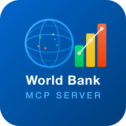

<p align="center">
  
</p>

<h1 align="center">🌍 World Bank MCP Server</h1>

<p align="center">
  <a href="https://www.npmjs.com/package/world-bank-mcp-server"></a>
  <a href="https://marketplace.visualstudio.com/items?itemName=bhayanak.world-bank-vscode-extension"></a>
  <a href="https://github.com/bhayanak/worldbank-mcp-server/actions"></a>
  <a href="https://github.com/bhayanak/worldbank-mcp-server/blob/main/LICENSE"></a>
</p>

<p align="center">
  A <strong>Model Context Protocol (MCP)</strong> server that brings <a href="https://data.worldbank.org/">World Bank Open Data</a> to AI assistants.<br/>
  10 tools · Zero authentication · LRU caching · Sparkline trends · Cross-country comparisons
</p>

---

## Packages

| Package | Description | Links |
|---------|-------------|-------|
| [`world-bank-mcp-server`](packages/world-bank-server/) | Standalone MCP stdio server | [README](packages/world-bank-server/README.md) · [npm](https://www.npmjs.com/package/world-bank-mcp-server) |
| [`world-bank-vscode-extension`](packages/world-bank-vscode-extension/) | VS Code extension with auto-registered MCP server | [README](packages/world-bank-vscode-extension/README.md) · [Marketplace](https://marketplace.visualstudio.com/items?itemName=bhayanak.world-bank-vscode-extension) |

## Quick Start

### Use with any MCP client

```bash
npx world-bank-mcp-server
```

```json
{
  "mcpServers": {
    "world-bank": {
      "command": "npx",
      "args": ["-y", "world-bank-mcp-server"]
    }
  }
}
```

### Use in VS Code

Install the extension → the MCP server auto-registers with start/stop/restart controls.

## Tools at a Glance

| Tool | What it does |
|------|-------------|
| `wb_get_indicator` | Indicator metadata |
| `wb_search_indicators` | Search by keyword |
| `wb_get_country` | Country profile + quick stats |
| `wb_list_countries` | Filter by region/income |
| `wb_get_data` | Indicator data (year range / MRV) |
| `wb_get_timeseries` | Long-range trends with sparklines |
| `wb_compare_countries` | Side-by-side comparison (2–6 countries) |
| `wb_list_topics` | Browse data topics |
| `wb_get_topic_indicators` | Topic → indicators |
| `wb_get_regional_data` | Regional aggregates |

## License

[MIT](LICENSE) © [bhayanak](https://github.com/bhayanak)
